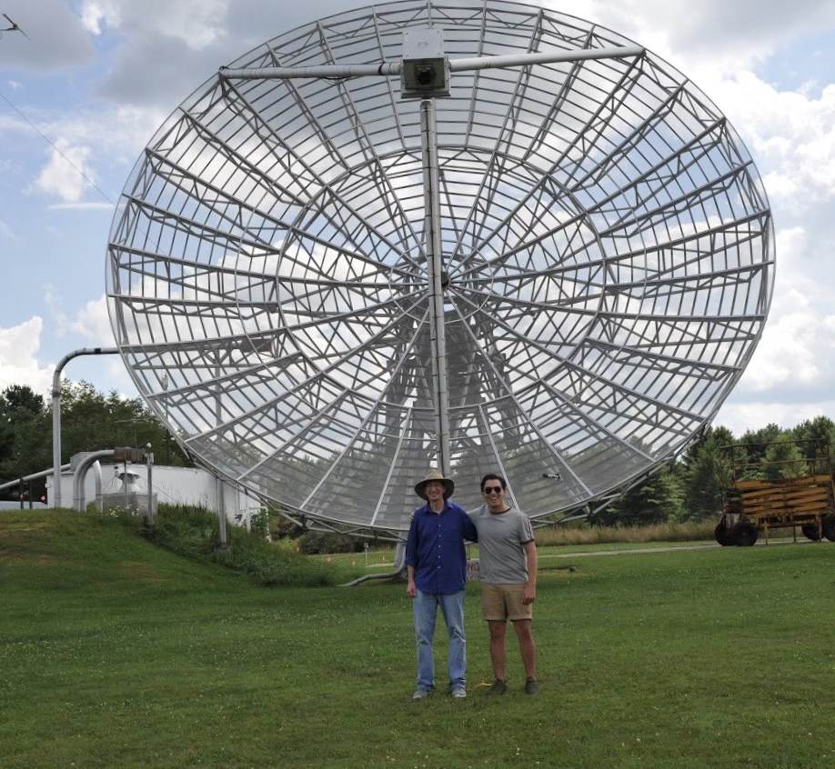

Hi and welcome to my page! My name is Jorge, I am a astrophyiscs PhD candidate at Arizona State University. My research focuses on charecterizing the atmopsheres of *substellar* objects, primarily exoplanets and brown dwarfs. To do this, my work involves using telescopes both on Earth and in space to study the light that comes from these astrnomical bodies. Some big questions I am looking to answer in my research are: 1) What are the compositons and climates of the amotpsheres of exoplanets and brown dwarfs 2) How do these observables change as a function of effective temperature or gravity in of these objects 3) How can we use what we learn from our current data reduction and atmopsheric modeling techniques to inform the next generation of exoplanet/brown dwarf science in the coming decade. 

------

I recieved a BS in Astrophysics from the University of Chicago in 2021. While in undergrad, I worked as a member of several research collaborations including the [Yerkes Plates Project](https://iopscience.iop.org/article/10.1088/1538-3873/abec20/pdf), the [COOL-LAMPS Collaboration](https://iopscience.iop.org/article/10.3847/1538-4357/abcb86/pdf) and the [MAROON-X Team](http://www.maroonx.science/). At ASU, I work with both Jenny Patience and Mike Line stuyding the spectra from brown dwarfs and exoplanet atmospheres. You can find the link to our group page [here](https://sites.google.com/a/asu.edu/michael-line-asu/welcome). You can learn more about me and my work using the links on the top of the page. Outside of work, I love watching films, basketball and going on hikes on some of the beautiful trails Arizona has to offer.

# Here are some pictures of during some observing runs! 

 

