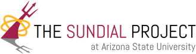

---
layout: archive
title: "Outreach"
permalink: /outreach/
author_profile: true
---  

 
Banner for the Sundial Project here at ASU.

At ASU, I am part of the Early Start program of the Sundial Project. Sundial is a program dedicated to the idea that science is for everyone. At Sundial, we focus on working with both incoming freshmen during the summer and undergraduate students during the school year on navigating STEM fields in college. These are students who are interested in majoring in Physics and Astronomy, but due to the great diversity that exists in the academic backgrounds of our incoming incoming majors, the goal of this program is to provide them with both valuable foundations in astronomy and physics related topics as well as a community of other undergraduates, grad students and faculty mentors with the common goal of making STEM accessible to everyone. For the past two years I participated as an academic facilitator, leading lectures and lab discussions given to the students, as well as providing resources on opportunities to get involved in academic research as an undergraduate. It has been an invaluable oppurtunity for me, since I didnt have a program like this when I was coming into college, and ive made really great connections with the students and facilitators during my time with Sundial.

If you're and ASU undergrad or graduate student who wants to get involved in sundial, check out this link [here](https://physics.asu.edu/sundial) for more information!
