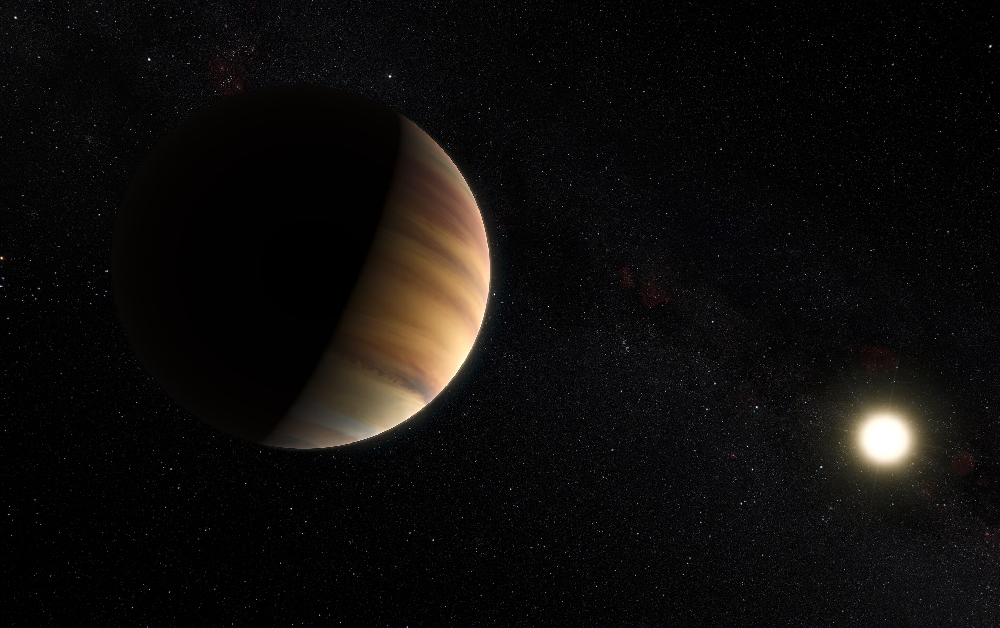
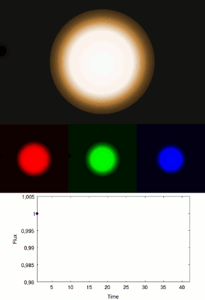
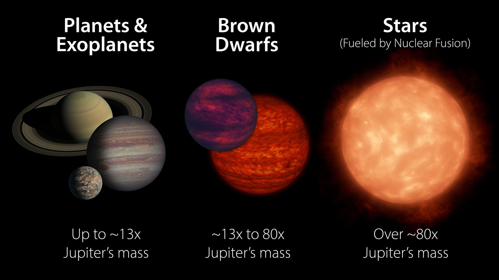

---
layout: archive
title: "Research"
permalink: /research/
author_profile: true
---  

The sum of my research focuses on charecertizing *substellar* objects, primarily bronw dwarfs and exoplanets, using spectroscopy from telescopes both on the ground and in space. Below is a brief description of each of these class of objects (and their subclasses) and the importance of their study in the field of astronomy.

Artist rendition of the first exoplanet discovered orbiting a sun-like star, 51 Pegasi b. (Credit, ESO)

## Brown Dwarfs 

Exoplanets are planets that orbit other stars in our galaxy. The first exoplanet, artist rendition above, was discovered in in 1995. Since then, over [5000 exoplanets](https://exoplanet.eu/plots/) have been discovered, covering a range of masses, sizes and temperatures. The majority of planets we have found are typically between the size of Earth and the planet Neptune, but we have found planets that are both smaller than Earth and larger than Jupiter, the biggest planet in our solar system. 

My work revolves around stuyding the light that comes from the atmopsheres of these planets, in order to understand what comprises these alien atmopsheres. The gif below demonstrates how we can learn about the composition of an atmosphere from stuyding the light from its host star that gets blocked by the planet as it passes in front of the face of the star, called a *transit*.

Effect on shape of transmission spectra as a function of different constituent gasses in a planetary atmosphere (Credit, Uppsala University)

As these planets orbit their host stars, they will sometimes have an orbital geometry where they can pass right in between the face of the star and our view of the system. When it does, star light passes through the atmosphere of the planet, and is fitered through until it eventually reaches us. Different gases in the atmosphere absorb that incoming starlight, and this abrsobrtion happens at different wavelegnths depeding on the absorbtion medium. This is how astronmers are able to decipher what sort of molecules are present in the atmospheres of transiting exoplanets. By uncovering the molecular makeup of the atmopsheres of exoplanets, it can help us predict how and where they might have formed. This is critical for our research, since understanding how planets in other solar systems formed will help us place how we think our own solar system formed in context with the rest of the galaxy.

## Brown Dwarfs 

Visual showing the mass of brown dwarfs compared to planets and stars (Credit, NASA-JPL)

My research also focuses on studying the atmopsheres of brown dwarfs, which as shown in the figure above, are objects intermiadte in mass between the largest planets and smallest stars. Unlike stars, brown dwarfs are not massive enough to undergo nuclear fusion, (the fusion of hydrogen into heliuem which powers our own sun), although some brown dwarfs are heavy enough to fuse an isotope of Hydrogen, Deuterium. At the lower mass end, the atmospheres of brown dwarfs behave remarkbly similar to that of the largest exoplanets. But while the light from exoplanets is dominated by its host star, brown dwarfs can be found as free floating objects, and thus we can measure the light that comes directly the object via its *thermal emission*.
